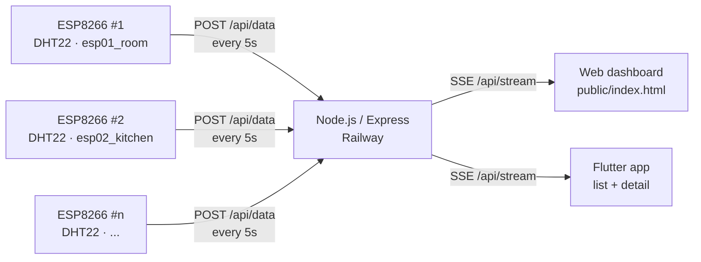

# ESP Multi-Device Monitor

Real-time temperature & humidity monitoring for multiple ESP8266 (DHT22) devices, with a Node.js backend (SSE) and a Flutter mobile app.


**Live server:** `https://esp-monitor-production.up.railway.app`

## Overview

Each ESP8266 reads a DHT22 sensor and `POST`s `{ device_id, temp, hum }` every 5 seconds.
The backend keeps an in-memory registry of all devices, tracks online/offline state per device
independently, and pushes live updates to web and mobile clients over Server-Sent Events (SSE).
Adding a new device requires zero backend or app changes — the first `POST` from a new
`device_id` registers it automatically.

## Features

- **Multi-device out of the box** — one firmware for all nodes, unique `deviceId` per board
- **Offline buffering** — the firmware stores readings in LittleFS flash when Wi-Fi is down (up to ~2000) and syncs them in batches on reconnect, with per-reading age so the server reconstructs timestamps
- **Live updates via SSE** — `init`, `data`, `status`, `device_added`, `device_removed` events
- **Per-device offline detection** — 12 s threshold checked every 2 s, one device going down doesn't affect the rest
- **Flutter app** — device list + detail views, shared real-time state, local push notifications per device
- **Zero-config onboarding** — new `device_id` appears in the app on first reading
- **Health & inspection endpoints** — `/health`, `/api/devices`, `/api/devices/:id`

## Architecture



## Tech Stack

| Layer    | Technology                                                              |
| -------- | ----------------------------------------------------------------------- |
| Firmware | ESP8266 (Arduino), DHT sensor library, ArduinoJson                      |
| Backend  | Node.js 18+, Express, CORS, Server-Sent Events, in-memory device registry |
| Mobile   | Flutter 3, `http` (SSE client), `flutter_local_notifications`           |
| Hosting  | Railway (Node service + generated domain)                               |

## Repository Structure

```
.
├── firmware/
│   └── esp8266_dht22.ino        # Unified firmware for all nodes (live send + offline LittleFS buffer with batch sync)
├── esp-server/
│   ├── server.js                # Express API + SSE + offline watchdog
│   ├── package.json
│   ├── .env.example             # PORT
│   └── public/
│       └── index.html           # Lightweight web dashboard (EventSource)
├── flutter_app/
│   ├── pubspec.yaml
│   ├── android_permissions_snippet.xml
│   └── lib/
│       ├── main.dart
│       ├── models/device_state.dart
│       ├── services/
│       │   ├── sse_service.dart            # SSE client with auto-reconnect
│       │   └── notification_service.dart   # Local notifications + haptics
│       └── screens/
│           ├── devices_screen.dart         # Device list (owns shared state)
│           └── device_detail_screen.dart   # Device detail (live via ValueNotifier)
└── README.md
```

## API Reference

Base URL (production): `https://esp-monitor-production.up.railway.app`

| Method   | Endpoint              | Description                                        |
| -------- | --------------------- | -------------------------------------------------- |
| `POST`   | `/api/data`           | Ingest a reading: `{ device_id, temp, hum, ts? }`      |
| `POST`   | `/api/data/batch`     | Sync buffered readings: `{ device_id, readings: [{ temp, hum, age?, ts? }] }` (max 500/batch) |
| `GET`    | `/api/stream`         | SSE stream of `init / data / status / device_added / device_removed` |
| `GET`    | `/api/devices`        | List all known devices with live `online` flag     |
| `GET`    | `/api/devices/:id`    | Single device with live `online` flag              |
| `DELETE` | `/api/devices/:id`    | Remove a device (broadcasts `device_removed`)      |
| `GET`    | `/health`             | `{ status, uptime, devicesCount }`                 |
| `GET`    | `/`                   | Web dashboard                                      |

### Examples

```bash
# Ingest a reading (what the ESP does)
curl -X POST https://esp-monitor-production.up.railway.app/api/data \
  -H "Content-Type: application/json" \
  -d '{"device_id":"esp01_room","temp":29.5,"hum":65}'

# List devices
curl https://esp-monitor-production.up.railway.app/api/devices

# Sync buffered readings (what the buffered firmware does on reconnect)
# age = how old each reading is in ms; server computes its timestamp
curl -X POST https://esp-monitor-production.up.railway.app/api/data/batch \
  -H "Content-Type: application/json" \
  -d '{"device_id":"esp01_room","readings":[{"temp":29.0,"hum":62,"age":600000},{"temp":30.0,"hum":64,"age":5000}]}'

# Health
curl https://esp-monitor-production.up.railway.app/health
```

### SSE event catalog

| Event            | Payload                                              | When                                        |
| ---------------- | ---------------------------------------------------- | ------------------------------------------- |
| `init`           | `Device[]`                                           | Immediately on connect (current snapshot)   |
| `data`           | `Device`                                             | Every new reading from any ESP              |
| `status`         | `{ device_id, online, timestamp, lastSeen }`         | Device goes offline or comes back           |
| `device_added`   | `Device`                                             | First reading from an unknown `device_id`   |
| `device_removed` | `{ device_id }`                                      | `DELETE /api/devices/:id`                   |

`Device` shape: `{ device_id, temp, hum, lastSeen, online }`

## Getting Started

### Prerequisites

- Arduino IDE with ESP8266 board support + libraries: `DHT sensor library`, `ArduinoJson`
- Node.js 18+
- Flutter 3.x (for the mobile app)

### 1. Backend

```bash
cd esp-server
cp .env.example .env   # optional local config
npm install
npm start              # serves on PORT (default 3000)
```

Deploy to Railway:

1. Push this repo to GitHub
2. [railway.app](https://railway.app) → **New Project** → **Deploy from GitHub** → select repo (service root: `esp-server`)
3. **Settings → Networking → Generate Domain**

### 2. Firmware (one file, N devices)

Single unified file: `firmware/esp8266_dht22.ino` — sends live readings when online,
and buffers to flash (LittleFS) when offline.

Buffered behavior: every 5 s the reading is sent live if possible, otherwise appended to
`/buffer.csv` (`millis,temp,hum`, capped at ~2000 lines / ~2.7 h, oldest dropped first).
On reconnect the live reading goes first, then the backlog flushes via `POST /api/data/batch`
with each reading's `age` so the server reconstructs its timestamp. The buffer survives
reboots; `backfilled` counts synced readings per device (visible in `GET /api/devices`).

1. Open `firmware/esp8266_dht22.ino` in Arduino IDE (libraries: `DHT sensor library`, `ArduinoJson`)
2. Tools → Flash Size → a variant with filesystem (e.g. `4MB (FS:1MB ...)`) so the offline buffer has space
3. Set Wi-Fi credentials and `serverURL`
4. **Set a unique `deviceId` per board before flashing:**

| Board | `deviceId`      |
| ----- | --------------- |
| #1    | `esp01_room`    |
| #2    | `esp02_kitchen` |
| #3    | `esp03_salon`   |

```cpp
const char* serverURL = "https://esp-monitor-production.up.railway.app/api/data";
const char* deviceId  = "esp01_room"; // unique per board
```

Wiring: DHT22 data pin → GPIO4, 5 s send interval, auto-reconnect on Wi-Fi drop.

### 3. Flutter app

```bash
flutter create esp_monitor
cd esp_monitor
# copy the contents of flutter_app/ over the new project
flutter pub get
flutter run
```

- Set `serverUrl` in `lib/main.dart` (defaults to the live server above)
- Add the permissions from `android_permissions_snippet.xml` to `android/app/src/main/AndroidManifest.xml`
- Alert thresholds live in `lib/models/device_state.dart`: temp 28–32 °C, humidity 60–70%

> `DevicesScreen` owns a `ValueNotifier<Map<String, DeviceState>>` shared with
> `DeviceDetailScreen`, so both views update in real time with no polling.

## Configuration

| Variable   | Where       | Required | Description                                    |
| ---------- | ----------- | -------- | ---------------------------------------------- |
| `PORT`     | Server      | No       | HTTP port (Railway injects it; default `3000`) |
| `serverURL`| Firmware    | Yes      | `https://<domain>/api/data`                    |
| `deviceId` | Firmware    | Yes      | Unique id per ESP board                        |
| `serverUrl`| Flutter app | Yes      | `https://<domain>` (no trailing `/api`)        |

Offline logic: a device is marked offline when `now - lastSeen > 12000 ms`
(`OFFLINE_THRESHOLD` in `esp-server/server.js`), re-evaluated every 2 s.

## Troubleshooting

| Symptom                          | Likely cause & fix                                                              |
| -------------------------------- | ------------------------------------------------------------------------------- |
| `DHT read failed` in serial log  | Wrong data pin or sensor wiring; confirm DHT22 data → GPIO4                     |
| ESP `HTTP 404/400`               | Wrong `serverURL` path (must end with `/api/data`) or missing `device_id`      |
| Device stuck "offline" in app    | ESP not reaching the server; check Wi-Fi creds and that `/health` is reachable  |
| SSE disconnects frequently       | Normal on flaky networks — both web and Flutter clients auto-reconnect          |

## Roadmap

- [ ] Persist readings (Postgres/Timescale) + history charts
- [ ] Auth on the API and per-user device scoping
- [ ] Configurable thresholds per device from the app
- [ ] iOS background modes polish

## نبذة بالعربية

المشروع يراقب عدة أجهزة ESP8266 (حساس DHT22) لحظيًا: كل جهاز يرسل الحرارة والرطوبة
كل 5 ثواني للسيرفر، والسيرفر يوزع التحديثات على الموبايل والمتصفح عبر SSE، مع كشف
مستقل لكل جهاز عند توقفه. لإضافة جهاز جديد يكفي تفليش
نفس الكود مع `deviceId` مختلف — لا حاجة لتعديل السيرفر أو التطبيق. والـ firmware يخزن القراءات
داخل ذاكرة الجهاز عند انقطاع الواي فاي ويرسلها كلها تلقائيًا عند عودة الشبكة.

## License

MIT — see [LICENSE](LICENSE).
